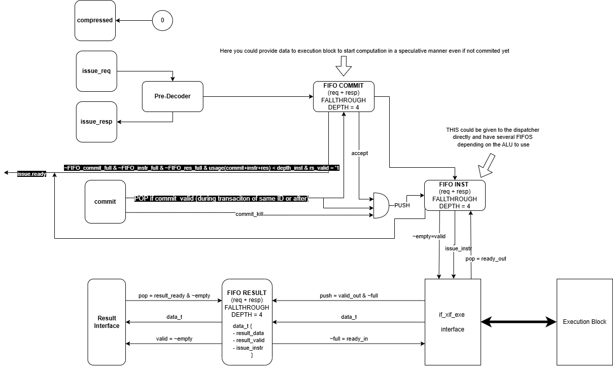

# X-IF Copro Wrapper

The `xif_wrapper` bridges the CV32E40x processor X-Interface (XIF) with a custom execution block. It ensures that custom instructions are correctly decoded, tracked, executed, and retired in order.

Incoming instructions are first **pre-decoded** to generate issue responses and validate required registers. Accepted instructions are stored in a **commit FIFO** until the core signals commit. Once committed, they are transferred to the **instruction FIFO**, which buffers them until the execution block is ready.

The execution block consumes instructions, produces results, and forwards them to a **result FIFO**, which temporarily stores them until the processor is ready to receive them.

Handshake signals are used throughout the design to manage flow control between the core, FIFOs, and execution block. This ensures:
- Instructions are only issued when resources are available
- Results are returned in order

This FIFO-based design decouples pipeline stages, providing elasticity, avoiding stalls, and supporting multiple in-flight instructions while simplifying integration with custom accelerators.

---

## Co-Processor Interface & Data Flow Overview

### Unused Interfaces
- Compressed interface → tied to `0`
- Memory interfaces → tied to `0`

### Issue Stage
- Issue interface (`req` / `resp`) is **combinational**
- Implemented in the pre-decoder to **avoid CPU stalls**

### FIFO_commit (First FIFO)
- Captures all issued instructions
- Stores entries **regardless of**:
  - Instruction being killed
  - Instruction being accepted
- Implemented as **fall-through**
  - Eliminates extra latency for the first instruction

### Issue Backpressure
Issue is stalled (`ready = 0`) when:
- Any FIFO is full
- Required source registers are not valid
- In-flight instructions exceed `INSTR_DEPTH`

### Commit Stage → FIFO_instr
- Only instructions that are:
  - Valid (not killed)
  - Accepted by the coprocessor  
  are pushed into `FIFO_instr`
- Corresponding issue must occur **before or in the same cycle**

### FIFO_instr (Second FIFO)
- Buffers instructions before execution
- Type depends on execution block:
  - **Standard** → purely combinational execution
  - **Fall-through** → pipelined/registered execution (required for XIF)
- Current design uses **fall-through**

### Execution Block
- Composed of:
  - Instruction **decoder**
  - **Accelerator** (custom logic)
- Connected via **ready/valid handshake**

### FIFO_result
- Stores execution results when the CPU is not ready
- Connected via **ready/valid handshake**

### Handshake & Control Signals
- Ready/valid logic must be adapted to:
  - Accelerator latency
  - Throughput requirements

### Configurability
- `INSTR_DEPTH` (default: `4`)
- Can be increased depending on:
  - CPU complexity
  - Instruction latency

### Interfaces
- XIF ↔ Execution block connection uses:
  - `if_xif_exe`

---

## Instruction Predecoder

The `instr_predecoder` is a **combinational block** that identifies coprocessor instructions and generates the corresponding issue response (`x_issue_resp_t`).

### Functionality
- Acts as an **instruction classifier**
- Compares incoming instructions against `CoproInstr`
- On match:
  - Outputs predefined response:
    - Accept
    - Writeback
    - Dual read/write
    - Control signals
- Generates `rs_valid_mask`:
  - Indicates required source operands

### Configurability
- Controlled by:
  - `CoproInstr` (`copro_issue_resp_t`)
  - `NbInstr`

---

## Execution Interface (`if_xif_exe`)

Defines the communication between the **XIF wrapper** and the **execution block** using a ready/valid handshake.

### Responsibilities
- Transfer issued instructions (wrapper → execution)
- Return execution results (execution → wrapper)

---

### Instruction Issue Path (Wrapper → Execution)

- Wrapper asserts `wrapper_exe_instr_valid`
- Provides `wrapper_exe_instr_issue`
- Execution asserts `exe_wrapper_recv_instr_ready`
- Transfer occurs when:
  - `valid && ready == 1`

---

### Result Return Path (Execution → Wrapper)

- Execution provides `exe_wrapper_result`
- Wrapper asserts `wrapper_exe_recv_result_ready`
- Transfer occurs when:
  - `valid && ready == 1`

---

### Modports
- `exe_unit` → execution block view
- `xif_wrapper` → wrapper view

---

### Signal Description

| Signal | Direction | Description |
|--------|----------|-------------|
| `wrapper_exe_instr_valid` | W → E | Valid instruction from wrapper |
| `wrapper_exe_instr_issue` (`x_issue_t`) | W → E | Instruction data (opcode, operands, control) |
| `exe_wrapper_recv_instr_ready` | E → W | Execution ready to accept instruction |
| `exe_wrapper_result` (`x_issue_fifo_res_t`) | E → W | Execution result (writeback, status, exception) |
| `wrapper_exe_recv_result_ready` | W → E | Wrapper ready to accept result |
